```{r setup, include=FALSE}
knitr::opts_chunk$set(echo = FALSE)
```

## Information générale

Ce document présente une introduction à la gestion des pêches et aux outils numériques associés. 
Il vient en support d’un cours destiné aux étudiants en Master 2 Sciences de la Mer de l'université de Caen.
Ce cours est accompagné d'un ensemble de travaux pratiques permettant d’appréhender la manipulation de l'information relative à la pêche et son analyse, en utilisant essentiellement le logiciel R [@r2020].
Ce document est sous license libre, et plus précisement [MIT](https://fr.wikipedia.org/wiki/Licence_MIT).
Les chaînes de caractères [bleues](https://fr.wikipedia.org/wiki/Bleu) sont cliquables et contiennent des liens hypertextes renvoyant vers des ressources extérieures.
Les références telles que @baumer2014 renvoient vers la bibliographie en fin de document (cliquable si le document est en affichage long).

La navigation au sein de ce document html peut s'effectuer à l'aide des touches suivantes :

- flèches droite et gauche pour naviguer en mode présentation
- C : plan du document
- F : fait apparaître ou disparaître la barre d'état de la présentation
- A : affiche le document sous la forme d'une présentation ou d'un document long (facilite l'impression par exemple)
- B et S : augmente ou diminue la taille d'affichage des caractères

## Organisation

- 12 heures : 
  - lundi 10 février 2025 (14h-17h), 
  - mardi 11 février 2025 (9h-12h, 14h-17h),
  - mercredi 12 février 2025 (9h-12h)
- en présentiel
- alternance de présentations et d'exercices pratiques
- matériels : un ordinateur avec [RStudio Desktop](https://rstudio.com/products/rstudio/download/) installé, et une connection internet  

## Ressources 

Les ressources se trouvent ici : **<https://github.com/ldbk/cours_introduction_halieutique>** :

- le répertoire **presentations** contient ce support en html et Rmarkdown
- le répertoire **applications** contient des ressources liées aux exemples pratiques
- le répertoire **img** contient les images illustrant ces supports

## L'intervenant

Laurent Dubroca (prénom.nom@ifremer.fr), Ifremer, laboratoire Ressources Halieutiques de Port-en-Bessin. 

### [L'Ifremer](https://wwz.ifremer.fr/) ?

<div class='left' style='float:left;width:70%' text-align='justify'>
"L'Institut français de recherche pour l’exploitation de la mer (Ifremer) contribue, par ses travaux et expertises,
à la connaissance des océans et de leurs ressources, à la surveillance du milieu marin et littoral et au
développement durable des activités maritimes. L’Ifremer est source de connaissances, d’innovation, de
données de surveillance et d’expertise pour le monde de la mer, à la fois en matière de politique publique et
d’activité socio-économique. Il est la seule structure de ce type en Europe.
Fondé en 1984, l'Ifremer est un établissement public à caractère industriel et commercial (EPIC), placé sous
la tutelle conjointe du ministère de l'Education nationale, de l'Enseignement supérieur et de la Recherche, du ministère de la Transition écologique, de la Biodiversité, de la Forêt, de la Mer et de la Pêche, et du Ministère de l'Agriculture et de la Souveraineté alimentaire."

**Composantes** : 5 centres et 24 d'implantations en métropole et dans le monde <https://www.ifremer.fr/fr/l-ifremer-en-france-et-dans-le-monde>.

**Missions** : approche intégrée de la recherche en sciences marines

- appui à la puissance publique : pour le déploiement des politiques maritimes (directive cadre, pêche...)
- valorisation économique : partenariat avec le monde industriel ou économique, innovations et transfert de technologies
- recherche et développement : développements technologiques, infrastructures et moyens d'essais
- gestion de la flotte : gestion de la flotte océanographique française
</div>

<div class='right' style='float:right;width:30%'>
```{r, echo=FALSE, out.width="100%", fig.cap=""}
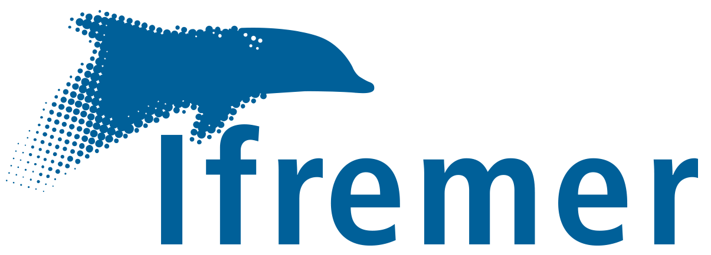
```

```{r, echo=FALSE, out.width="100%", fig.cap=""}
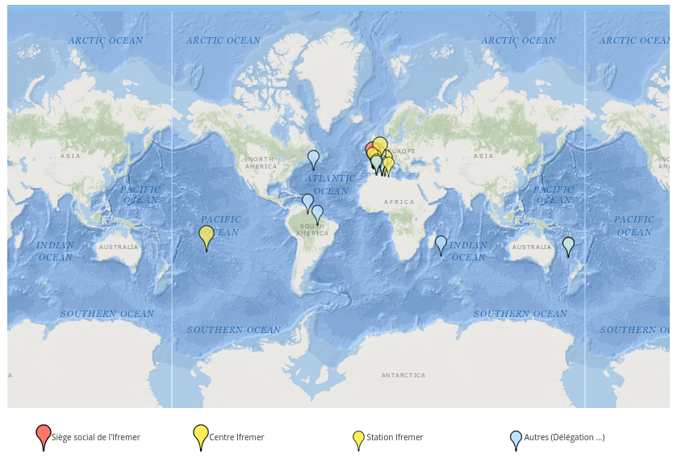
```

```{r, echo=FALSE, out.width="100%", fig.cap=""}
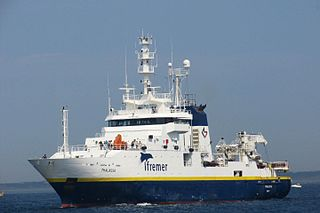
```
</div>

## Le laboratoire Ressources Halieutiques de l'Ifremer à Port-en-Bessin

Positionnement géographique

```{r, echo=FALSE, out.width="100%", fig.cap=""}
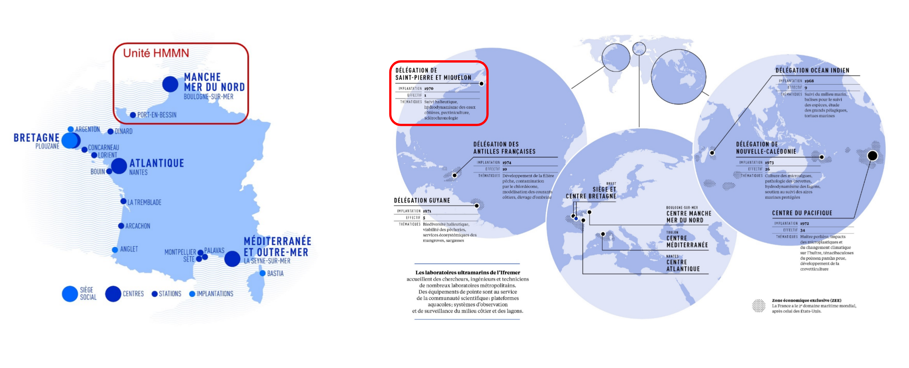
```

## Le laboratoire Ressources Halieutiques de l'Ifremer à Port-en-Bessin

Positionnement organisationnel


```{r, echo=FALSE, out.width="100%", fig.cap=""}
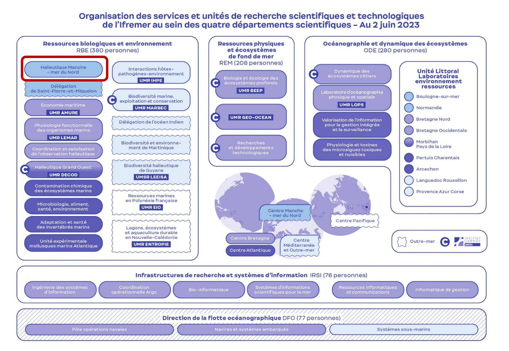
```

## Le laboratoire Ressources Halieutiques de l'Ifremer à Port-en-Bessin

Positionnement thématique

```{r, echo=FALSE, out.width="100%", fig.cap=""}
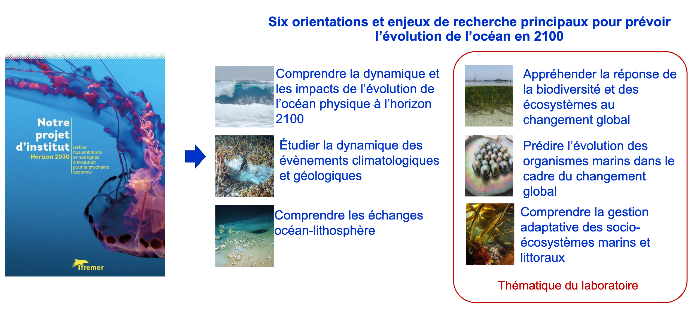
```

## Le laboratoire Ressources Halieutiques de l'Ifremer à Port-en-Bessin

Objectifs

```{r, echo=FALSE, out.width="100%", fig.cap=""}
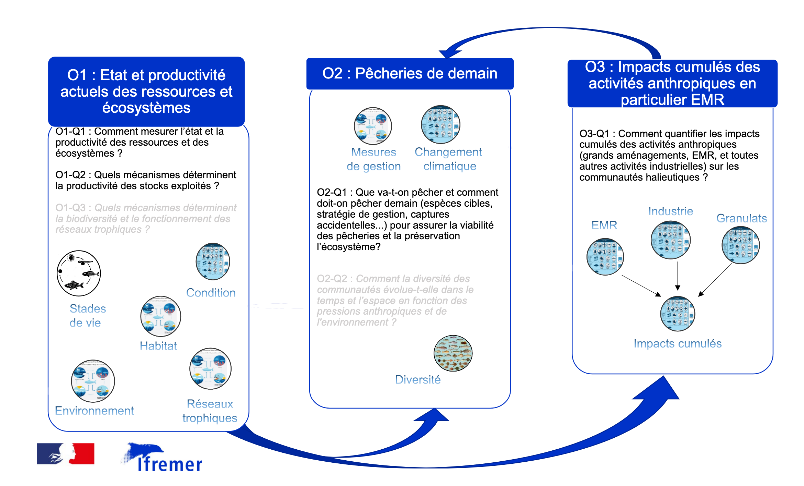
```

## Le laboratoire Ressources Halieutiques de l'Ifremer à Port-en-Bessin

Objectif 1

```{r, echo=FALSE, out.width="100%", fig.cap=""}
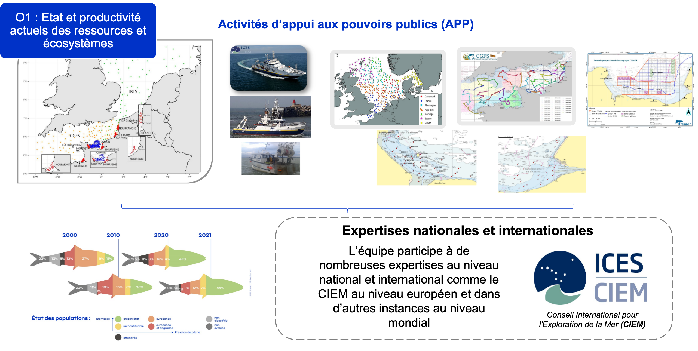
```

```{r, echo=FALSE, out.width="100%", fig.cap=""}
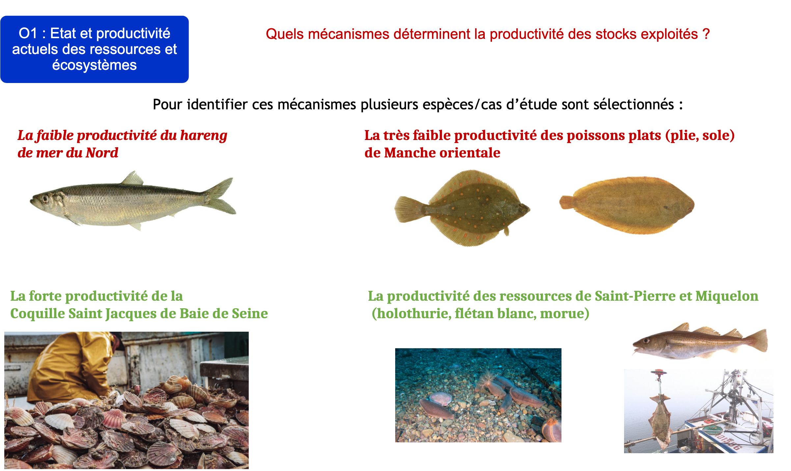
```

```{r, echo=FALSE, out.width="100%", fig.cap=""}
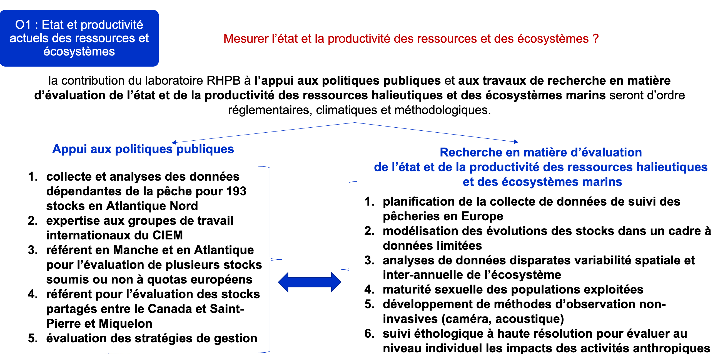
```


## Le laboratoire Ressources Halieutiques de l'Ifremer à Port-en-Bessin

Objectif 2

```{r, echo=FALSE, out.width="100%", fig.cap=""}
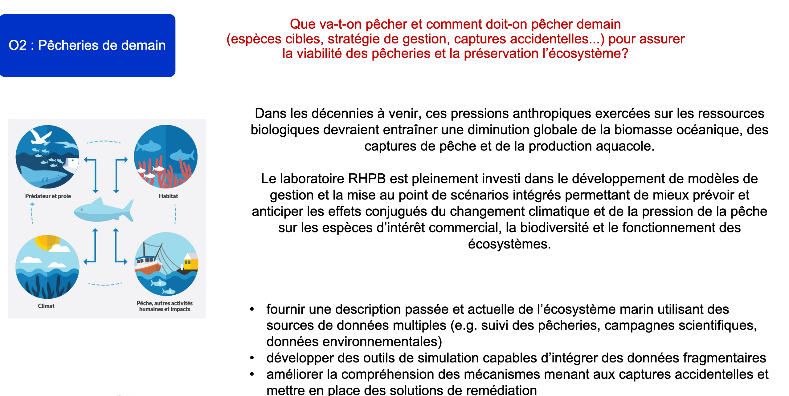
```

## Le laboratoire Ressources Halieutiques de l'Ifremer à Port-en-Bessin

Objectif 3

```{r, echo=FALSE, out.width="100%", fig.cap=""}
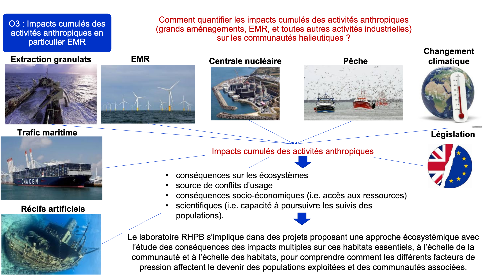
```

## Bibliographie
