```{r setup, include=FALSE}
knitr::opts_chunk$set(echo = FALSE)
```

## Définitions générales

- pêche : activité humaine consistant à capturer des animaux aquatiques dans leur milieu
- animaux : poissons, crustacés, mollusques, céphalopodes, gastéropodes, etc.
- milieu : **océans, mers**, cours d'eau, lacs, etc.
- activités humaines : **pêche professionnelle** (à visée commerciale: industrielle, artisanale), récréative, sportive ou de subsistance
- aquaculture : activités de production animale ou végétale en milieu aquatique. L'aquaculture se pratique dans des rivières ou dans des étangs, en bord de mer. On parle dans ce cas de « cultures marines » ou mariculture). 
- captures : quantités prélevées du milieu par différentes techniques et engins de pêche
- halieutique : ensemble des disciplines scientifiques relatives à l'exploitation et la gestion des ressources vivantes des milieux aquatiques

*Nous nous intéresserons dans ce cours aux pêches maritimes*

[lien](<https://fr.wikipedia.org/wiki/P%C3%AAche_(halieutique)>)

## Définitions halieutiques : population et stock

- population biologique : ensemble des individus vivant dans un écosystème donné avec des caractères communs transmissibles par hérédité (~population isolée et homogène)
- stock (théorie) : fraction exploitable d'une population biologique
- stock (unité de gestion) : 
  - ensemble des individus exploitables d'une espèce donnée, isolé des stocks voisins, homogène
  - unité de travail pour les travaux en dynamique des populations liés à la gestion
  
*Source : @gascuel2008*
  
## Définitions halieutiques : population et stock

Exemple : zones géographiques délimitant les stocks en Atlantique Nord-Est

```{r, echo=FALSE, out.width="60%", fig.cap=""}
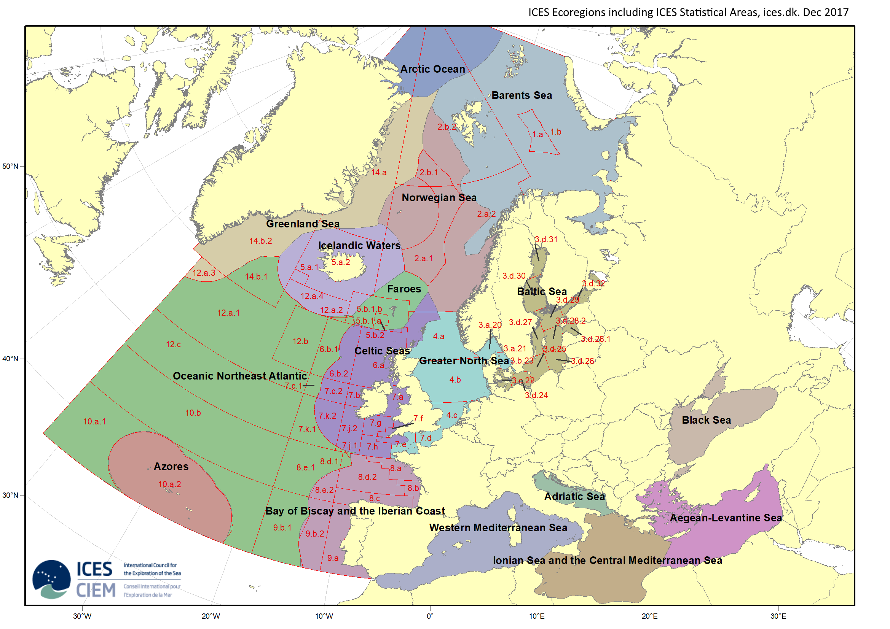
```

[source](https://www.ices.dk/data/Documents/Maps/ICES-Ecoregions-hybrid-statistical-areas.png)

## Zone économique exclusive (ZEE)

<div class='left' style='float:left;width:60%' text-align='justify'>

Bande de mer ou d'océan située entre les eaux territoriales et les eaux internationales, sur laquelle un État riverain dispose de l'exclusivité d'exploitation des ressources. 

Bande limitée par la ligne des 200 milles marins internationaux (370 km) à partir de la ligne de base en l'absence d'autre rivage. Si le rivage le plus proche est à moins de 200 milles nautiques, on utilise la frontière à mi-distance des lignes de base des deux pays riverains.

</div>

<div class='right' style='float:right;width:40%'>

```{r, echo=FALSE, out.width="70%", fig.cap=""}
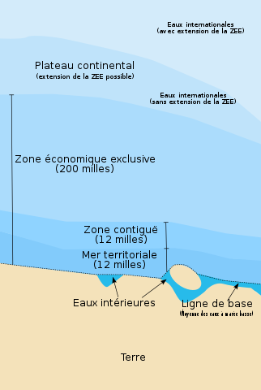
```

[source](https://fr.wikipedia.org/wiki/Zone_%C3%A9conomique_exclusive)

</div>

## Zone économique exclusive (ZEE)

Les ZEE européennes

```{r, echo=FALSE, out.height="70%", fig.cap=""}

```

[source](https://hub.arcgis.com/datasets/schools-BE::world-exclusive-economic-zones-boundaries/explore?layer=0&location=49.115711%2C6.546208%2C3.86)


## L'océan mondial

 - océan mondial : 70.8% de la surface de la Terre (361 millions de km2)
 - eaux internationales : 65% de la surface des océans


```{r, echo=FALSE, out.width="60%", fig.cap=""}
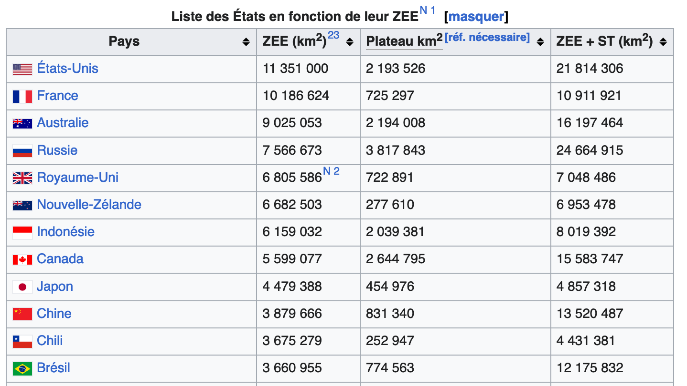
```

[source](https://fr.wikipedia.org/wiki/Zone_%C3%A9conomique_exclusive)

## ZEE globale

```{r, echo=FALSE, out.width="60%", fig.cap=""}
knitr::include_graphics("../img/zee_world.jpg")
```

[source](<https://www.marineregions.org/eezmapper.php>)

## ZEE française

```{r, echo=FALSE, out.width="60%", fig.cap=""}
knitr::include_graphics("../img/zee_france.png")
```

[source](<https://histoire-itinerante.fr/cartotheque/carte-des-zones-economiques-exclusives-zee-par-pays-de-lue/>)

## De l'espace comme contrainte en gestion halieutique 

La structure spatiale d'un stock peut recouvrir plusieurs ZEE, et des eaux internationales. Son exploitation peut donc dépendre de plusieurs états, et la gestion ne peut être limitée à des approches nationales.

<div class='right' style='float:right;width:50%'>

```{r, echo=FALSE, out.width="80%", fig.cap=""}

```
</div>


<div class='left' style='float:left;width:50%'>


```{r, echo=FALSE, out.width="100%", fig.cap=""}

```

</div>
## Les organisations de gestion

Organisations régionales de gestions des pêches (ORGP - RFMO)

- les ORGP sont des organismes internationaux mis en place par les pays
et des organisations internationales (e.g. UE) ayant des intérêts en matière de pêche liés à une même région, ou à une même espèce ou un même groupe d’espèces. 
- au sein de ces organismes, ses membres établissent collectivement des mesures contraignantes fondées sur des données scientifiques, telles que les limites applicables en matière de
captures et d’effort de pêche, ainsi que des
mesures techniques et des obligations de
contrôle destinées à assurer la préservation et
à garantir une gestion durable et équitable des
ressources marines partagées.

## Les organisations de gestion

```{r, echo=FALSE, out.width="80%", fig.cap=""}
knitr::include_graphics("../img/orgp.png")
```

## Les organisations de gestion

L'ICES : International Council for the Exploration of the Seas (CIEM : Conseil International pour l'Exploration de la Mer)

<div class='right' style='float:right;width:50%'>

```{r, echo=FALSE, out.width="80%", fig.cap=""}

```
</div>


<div class='left' style='float:left;width:50%'>


```{r, echo=FALSE, out.width="80%", fig.cap=""}

```

</div>

## Europe : organisation de producteurs

Les pêcheurs et les aquaculteurs peuvent constituer des organisations de producteurs
afin d’assurer la durabilité de leur production et
de commercialiser leurs produits. Ils élaborent à cet effet des plans de production
et de commercialisation. En 2021, on dénombrait
204 organisations de producteurs dans 18 États
membres.

```{r, echo=FALSE, out.width="50%", fig.cap=""}
knitr::include_graphics("../img/eu_orgaprod1.png")
```


## Une activité globale

FAO ?

- l'Organisation des Nations unies pour l’alimentation et l’agriculture (ONUAA ou **FAO** : Food and Agriculture Organization of the United Nations) est une organisation spécialisée du système des Nations unies, créée en 1945 à Québec. Son siège est à Rome, au Palazzo FAO, depuis 1951. Depuis le 15 juin 2013, la FAO compte 197 membres, soit 194 pays membres, une Organisation membre (l’Union européenne) et deux membres associés (les Îles Féroé et Tokelau).
- Objectif « Aider à construire un monde libéré de la faim », (« Fiat panis » : qu'il y ait du pain). 

## Statistiques globales ([FAO, 2022](<https://www.fao.org/documents/card/en?details=cc0461en>))


<div class='left' style='float:left;width:50%'>

- production : **179 millions de t en 2020**, en augmentation (3% par an 1961-2019)

</div>
<div class='right' style='float:right;width:50%'>


```{r, echo=FALSE, out.width="100%", fig.cap=""}
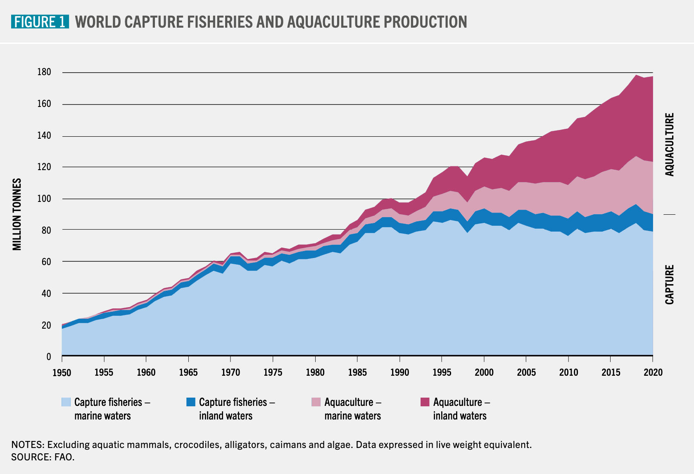
```
</div>

## Statistiques globales ([FAO, 2022](<https://www.fao.org/documents/card/en?details=cc0461en>))

<div class='left' style='float:left;width:50%'>

- production : **179 millions de t en 2020**, en augmentation (3% par an 1961-2019)
- consommation par habitant (animaux aquatiques) : **20.2 kg en 2020**, 

</div>
<div class='right' style='float:right;width:50%'>


```{r, echo=FALSE, out.width="80%", fig.cap=""}
knitr::include_graphics("../img/fao_prod2.png")
```
</div>

## Statistiques globales ([FAO, 2022](<https://www.fao.org/documents/card/en?details=cc0461en>))

<div class='left' style='float:left;width:50%'>

- production : **179 millions de t en 2020**, en augmentation (3% par an 1961-2019)
- consommation par habitant (animaux aquatiques) : **20.2 kg en 2020**, 
- 50% pêche / 50% aquaculture

</div>
<div class='right' style='float:right;width:50%'>


```{r, echo=FALSE, out.width="70%", fig.cap=""}
knitr::include_graphics("../img/fao_prod3.png")
```
</div>

## Statistiques globales ([FAO, 2022](<https://www.fao.org/documents/card/en?details=cc0461en>))

<div class='left' style='float:left;width:50%'>

- production : **179 millions de t en 2020**, en augmentation (3% par an 1961-2019)
- consommation par habitant (animaux aquatiques) : **20.2 kg en 2020**, 
- 50% pêche / 50% aquaculture
- 63% dans les eaux marines (70% pêche / 30% aquaculture) et 37% dans les eaux continentales (17% pêche / 83% aquaculture)

</div>
<div class='right' style='float:right;width:50%'>


```{r, echo=FALSE, out.width="80%", fig.cap=""}
knitr::include_graphics("../img/fao_tab1.png")
```
</div>


## Captures globales et européennes 

```{r, echo=FALSE, out.width="80%", fig.cap=""}
knitr::include_graphics("../img/eu_catch2.png")
```


## Captures globales et européennes 

```{r, echo=FALSE, out.width="80%", fig.cap=""}
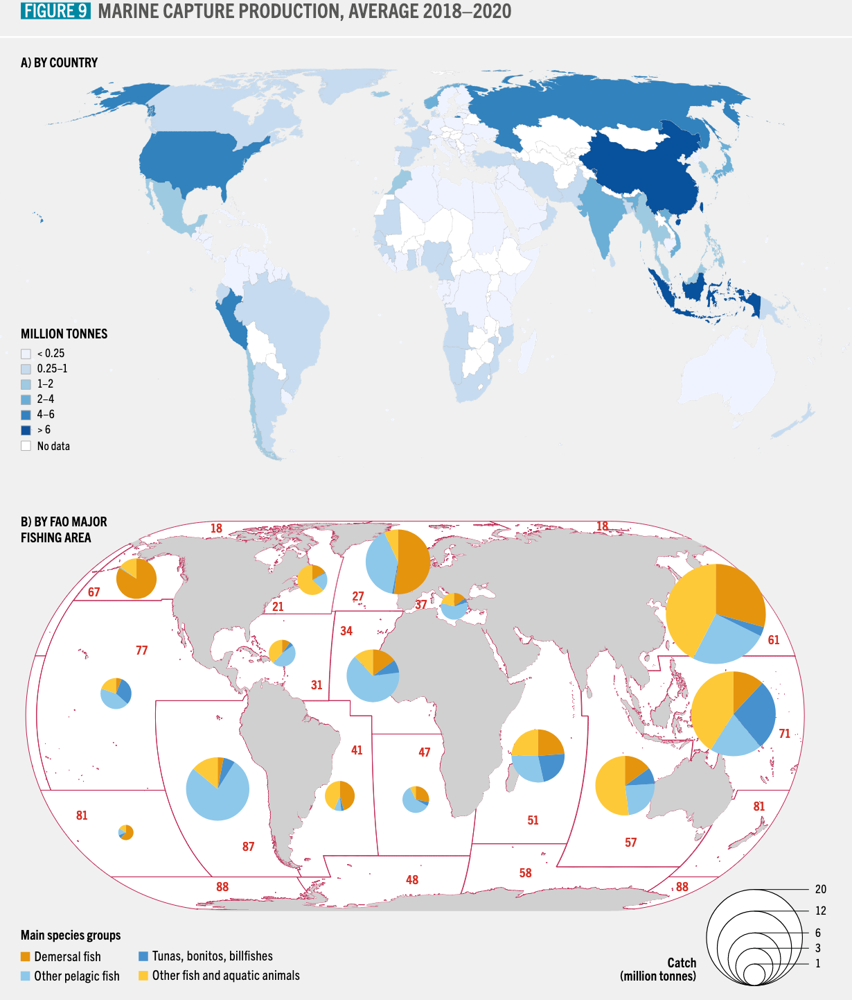
```


## Status d'exploitation des stocks

Quelques définitions :

- **Rendement Maximal Durable (RMD) / Maximum Sustainable Yield (MSY) ** : quantité maximale prélevée par la pêche sur un stock de poissons sans compromettre son renouvellement naturel. Il correspond au niveau d’exploitation où le stock peut se reconstituer naturellement d’une année sur l’autre malgré les prélèvements effectués par la pêche.
- Soit $B$ est la biomasse du stock considérée, $B_{MSY}$ la biomasse du stock à son niveau d'exploitation durable maximum et $B_{lim}$ le seuil de biomasse en dessous duquel le stock risque de ne plus pouvoir se renouveler correctement. Lorsque la biomasse d’un stock descend sous ce niveau, le recrutement (l’arrivée de nouveaux individus dans la population) est fortement compromis, augmentant le risque d’effondrement du stock.
- Soit $F$ la mortalité par pêche, et $F_{MSY}$ la mortalité par pêche au niveau d'exploitation durable maximum.


## Status d'exploitation des stocks

Quelques définitions : $B$ biomasse / $F$ mortalité par pêche / $MSY$ : max sust yield 

| **Statut de gestion**       | **Condition**                                      | **Mesures recommandées** |
|-----------------------------|----------------------------------------------------|--------------------------|
| **Pêche durable**           | \( B > B_{MSY} \) et \( F \leq F_{MSY} \)         | Maintenir la gestion actuelle. |
| **Exploitation à risque**   | \( B_{lim} < B \leq B_{MSY} \) et \( F > F_{MSY} \) | Réduire la pression de pêche (quotas, effort, zones protégées). |
| **Stock menacé**            | \( B \leq B_{lim} \)                              | Mesures d’urgence (fermetures, restrictions strictes). |
| **Stock en rétablissement** | \( B \) en augmentation après gestion stricte     | Maintenir les efforts de conservation et ajuster progressivement la pêche. |

## Status d'exploitation des stocks

Quelques définitions : $B$ biomasse / $F$ mortalité par pêche / $MSY$ : max sust yield 

```{r, echo=FALSE, out.width="80%", fig.cap=""}
knitr::include_graphics("../img/graphbmsy.png")
```


## Status d'exploitation des stocks  ([FAO, 2022](<https://www.fao.org/documents/card/en?details=cc0461en>))


```{r, echo=FALSE, out.width="80%", fig.cap=""}
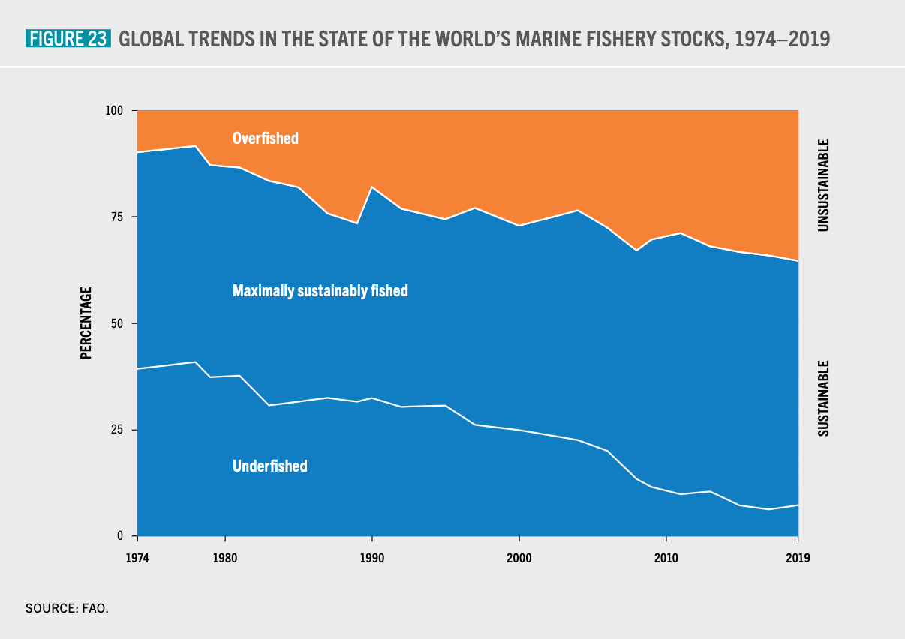
```

## Status d'exploitation des stocks ([FAO, 2022](<https://www.fao.org/documents/card/en?details=cc0461en>))

```{r, echo=FALSE, out.width="80%", fig.cap=""}
knitr::include_graphics("../img/fao_prod11.png")
```

## Status d'exploitation des stocks ([FAO, 2022](<https://www.fao.org/documents/card/en?details=cc0461en>))

```{r, echo=FALSE, out.width="50%", fig.cap=""}
knitr::include_graphics("../img/fao_trend2.png")
```

## Evolution des pressions subies par les écosystèmes marins 1860-2020 ([FAO, 2022](<https://www.fao.org/documents/card/en?details=cc0461en>))

```{r, echo=FALSE, out.width="100%", fig.cap=""}
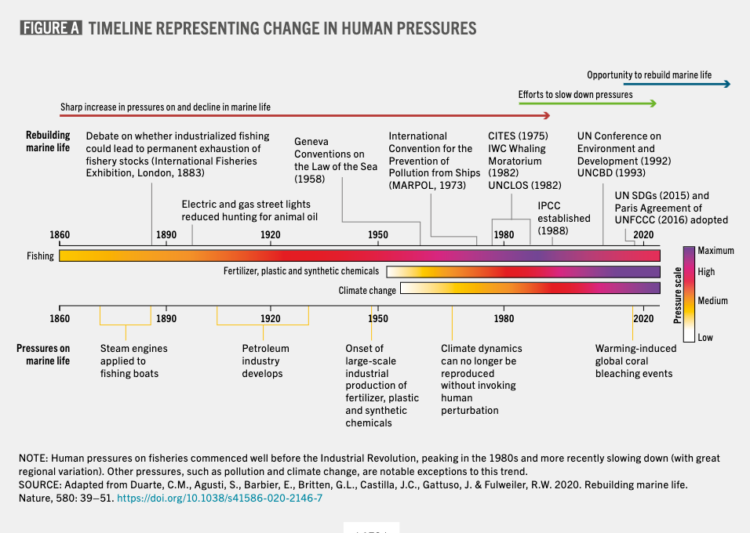
```

## Evolution des débarquements globaux par océan

```{r, echo=FALSE, out.width="70%", fig.cap=""}
knitr::include_graphics("../img/fao_prod12.png")
```

## Les moyens : engins

```{r, echo=FALSE, out.width="100%", fig.cap=""}

```

## Les moyens : flottilles

5 millions de navire de pêche (estimation FAO, 2022)

Navire de pêche par continent en 2020 : 

```{r, echo=FALSE, out.width="100%", fig.cap=""}
knitr::include_graphics("../img/fao_fleet3.png")
```


## Les moyens : flottilles

5 millions de navire de pêche (estimation FAO, 2022)


```{r, echo=FALSE, out.width="100%", fig.cap=""}
knitr::include_graphics("../img/fao_fleet1.png")
```


## Flottilles en Europe

```{r, echo=FALSE, out.width="100%", fig.cap=""}
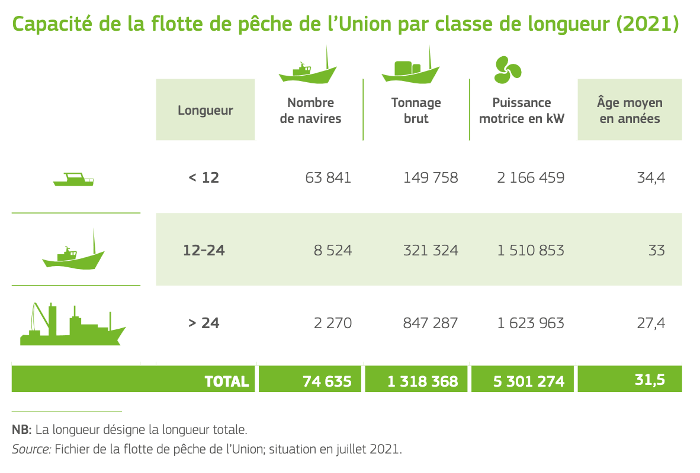
```

[source](<https://oceans-and-fisheries.ec.europa.eu/facts-and-figures/facts-and-figures-common-fisheries-policy_en>)

## Flottilles en Europe par pays

```{r, echo=FALSE, out.width="100%", fig.cap=""}
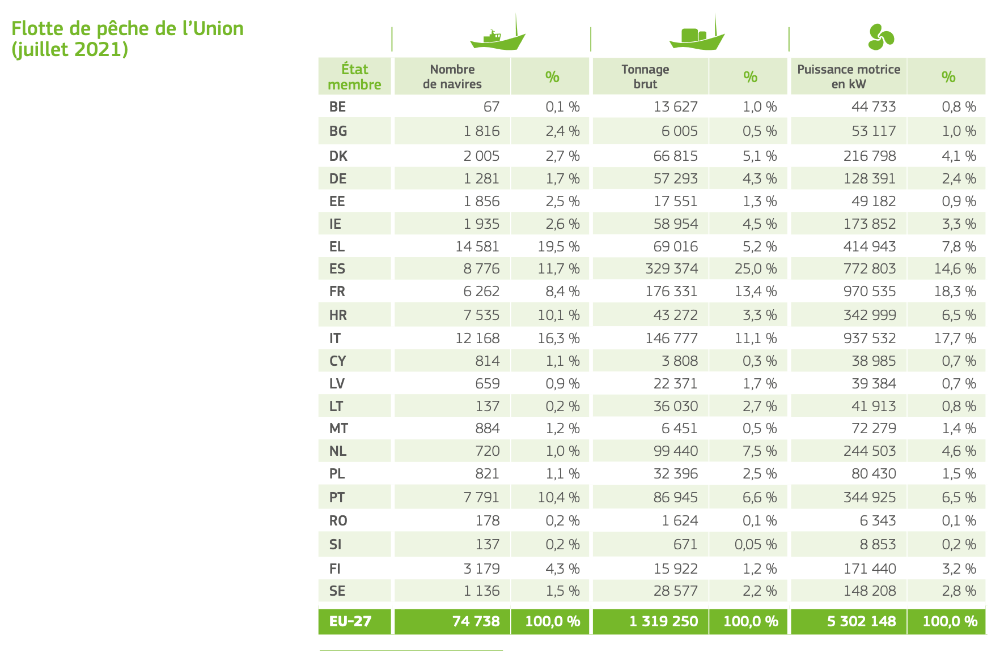
```

## Evolution des flottilles en Europe

```{r, echo=FALSE, out.width="100%", fig.cap=""}
knitr::include_graphics("../img/eu_fleet3.png")
```


## Consommation globale

```{r, echo=FALSE, out.width="100%", fig.cap=""}
knitr::include_graphics("../img/fao_fish1.png")
```

## Consommation par pays 

```{r, echo=FALSE, out.width="100%", fig.cap=""}
knitr::include_graphics("../img/fao_fish2.png")
```
## Consommation par pays : contribution à l'apport de protéine animale par pays


```{r, echo=FALSE, out.width="100%", fig.cap=""}
knitr::include_graphics("../img/fao_fish3.png")
```

## Pays importateurs


```{r, echo=FALSE, out.width="100%", fig.cap=""}
knitr::include_graphics("../img/fao_eco2.png")
```


## Pays exportateurs

```{r, echo=FALSE, out.width="100%", fig.cap=""}
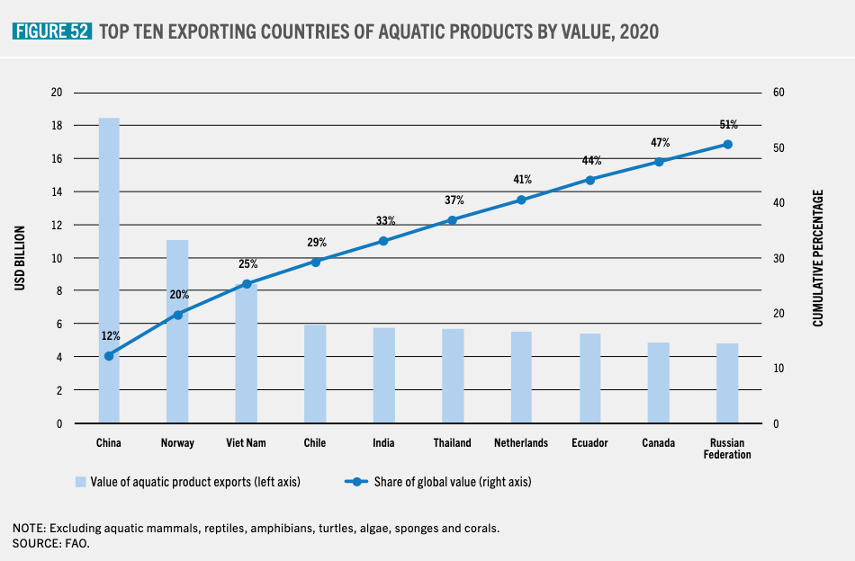
```

## Evolution d'un indice de prix

```{r, echo=FALSE, out.width="100%", fig.cap=""}
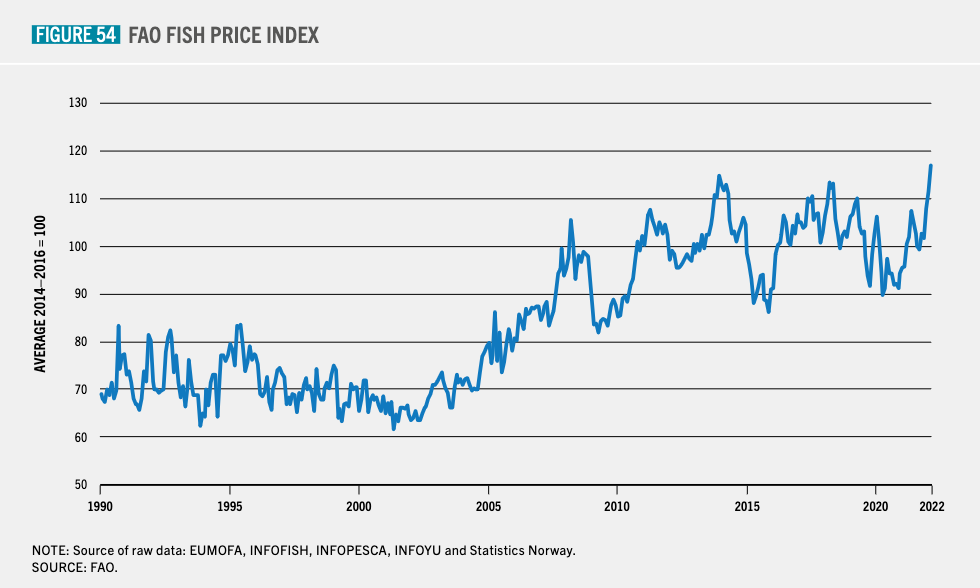
```


## Europe : captures

Origine

```{r, echo=FALSE, out.width="100%", fig.cap=""}
knitr::include_graphics("../img/eu_catch1.png")
```


## Europe : captures

Espèces EU


```{r, echo=FALSE, out.width="100%", fig.cap=""}
knitr::include_graphics("../img/eu_catch3.png")
```


## Europe : captures

Espèces FR

```{r, echo=FALSE, out.width="100%", fig.cap=""}
knitr::include_graphics("../img/eu_catch4.png")
```


## Exportation et importation EU : fournisseurs

```{r, echo=FALSE, out.width="100%", fig.cap=""}
knitr::include_graphics("../img/eu_eco1.png")
```

## Exportation et importation EU : clients


```{r, echo=FALSE, out.width="100%", fig.cap=""}
knitr::include_graphics("../img/eu_eco2.png")
```


## Europe : autosuffisance

- autosuffisance : apport entre la production propre (captures plus aquaculture) et la consommation apparente totale. 

En 2019, le taux d’autosuffisance de l’UE s’élevait à 41,2 % : la consommation est le double de la production européenne.

```{r, echo=FALSE, out.width="100%", fig.cap=""}
knitr::include_graphics("../img/eu_autosuf1.png")
```


## Bibliographie
