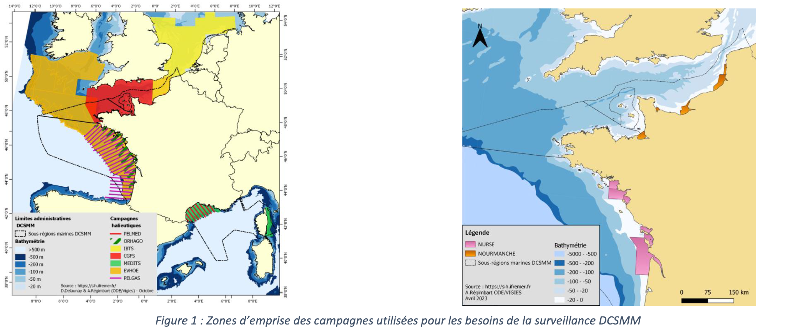
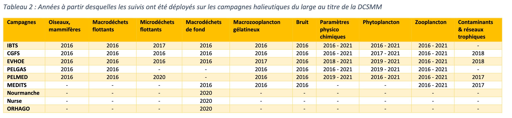

```{r setup, include=FALSE}
knitr::opts_chunk$set(echo = FALSE)
```

## Plan

04/02/2024 : organisation et notions générales sur les pêches
05/02/2024 : statistiques des pêches, gestion des pêches

## Statistiques des pêches

Pour renseigner l'activité de pêcheries il faut :

- les captures : débarquements, rejets, captures accidentelles 
- l'effort de pêche
- les paramètres liées à la capturabilité des engins de pêche
- les paramètres biologiques liées aux captures : structure en taille, en âge, maturité sexuelle
- des informations relatives à la biomasse indépendante des activités de pêche
- tout autre paramètre utile à la compréhension de la dynamique de la population exploitée : migration (marquage), caractéristique génétique ou fonctionnelle (délimitation des stocks)
- on distingue les données dépendantes des pêcheries (captures, etc.) des données indépendantes (e.g. les campagnes scientifiques) 


## Statistiques des pêches en France

La collecte des données est coordonnée par l'Ifremer.

[source](<sih.ifremer.fr>)

```{r, echo=FALSE, out.width="100%", fig.cap=""}
knitr::include_graphics("../img/sacrois.png")
```

## Statistiques des pêches

Echantillonnages OBSMER [source](<sih.ifremer.fr>)

```{r, echo=FALSE, out.width="100%", fig.cap=""}
knitr::include_graphics("../img/obsmer.png")
```

```{r, echo=FALSE, out.width="100%", fig.cap=""}
knitr::include_graphics("../img/obsmer2.png")
```

## Campagnes halieutiques

```{r, echo=FALSE, out.width="100%", fig.cap=""}

```


```{r, echo=FALSE, out.width="100%", fig.cap=""}

```

Les données récoltées sont disponibles en ligne : 

- <https://sih-indices-campagnes.ifremer.fr/>
- <https://datras.ices.dk/Data_products/Download/Download_Data_public.aspx>


## Définitions halieutiques (suite)

Source : @gascuel2008
  
#### Recrutement et cohorte

- recrutement : processus par lesquel les individus acquièrent une propriété qui les rend exploitable par la pêche (déplacement vers les zones de pêche, taille, comportement, etc.)
- âge et taille de recrutement : séparation entre une phase jeune (larves, post-larves et premiers stades juvéniles) à mortalité naturelle élevée, plasticité phénotypique, sensibilité à l'environnement vs phase plus âgée (juvéniles et adultes) moins sensible à la variabilité environnementale
- par extension : ensemble des individus recrutés à une date donnée

- cohorte : ensemble des individus d'un stock donné, né à une période donnée. En général une cohorte par an (si une seule saison de reproduction). Définie par l'année de naissance ou année de recrutement

### Phase exploitable et phase exploitée

- accessibilité des cohortes à l'exploitation 
- résultante d'une mesure de gestion (maillage, période autorisée, etc.)

```{r, echo=FALSE, out.width="70%", fig.cap=""}
knitr::include_graphics("../img/cohorte_exploit.png")
```

#### Abondance, production et productivité biologique d'un stock

- abondance : mesure de la quantité d'individus présents dans le stock, en effectif (nombre d'individus, N) ou en biomasses (en tonnes, B)
- production biologique d'un stock (P) : quantité nette d'individus (en nombre ou en biomasse) produite pendant un intervalle de temps.

<div class='left' style='float:left;width:50%'>
En effectif : $$ P=\frac{dN}{dt}$$
</div>

<div class='right' style='float:right;width:50%'>
En biomasse : $$ P=\frac{dB}{dt}$$
</div>

- la production biologique (P) est la résultate de trois phénomènes : 
  - la reproduction : facteur d'accroissement de l'abondance
  - la mortalité : facteur de décroissance
  - la croissance pondérale : facteur de croissance (dans le raisonnement en biomasse)

- la productivité biologique est le ratio de la production biologique sur l'abondance (donc la production par individu ou unité de biomasse) :

<div class='left' style='float:left;width:50%'>
En effectif : $P=\frac{1}{N}\frac{dN}{dt}$
</div>

<div class='right' style='float:right;width:50%'>
En biomasse : $P=\frac{1}{B}\frac{dB}{dt}$
</div>

### Caractérisation de l'exploitation

#### Flottille et métier

Fichier FPC, engin et modalités des captures


#### Effort de pêche

- effort de pêche : mesure de l'activité de pêche 
- utilisé dans les modèles de dynamiques de population et base des mesures de gestion des stocks
- exemple : nombre de navires, nombre de jours de pêches
- élément essentiel de la variabilité de l'exploitation

  - effort de pêche nominal : paramètre de gestion qui mesure l'accumulation des moyens de capture pour exploiter un stock par unité de temps
  - effort de pêche effectif : paramètre d'évaluation qui mesure la pression réelle exercée sur un stock par unité de temps

- diagramme d'exploitation et régime d'exploitation


### Capturabilité et captures

- stock
- bon état des stocks : 
- exploitation durable d'un stock

## Modélisation

[ressources](<https://haddonm.github.io/URMQMF/on-modelling.html>)

### Généralités

- tout modèle est une abstraction ou une simulation de ce qui est connu sur le processus ou le phénomène simulé
- un modèle n'est pas une copie conforme de ces connaissances : la modélisation est une affaire de choix sur les processus les plus structurants pour le processus
- un modèle mathématique est un type de modèle (modèle physique, verbal, graphique, etc.)
- déterministe ou stochastique
- continu ou discret
- réaliste ou général
- paramètres
- variables

## 


### Modèle de Scheafer

Modèle de la dynamique de la biomasse d'un stock [@scheafer1957]
Modèle logistique discret,modèles globaux ou modèles de production ("surplus production models" en anglais).


$$
B_{t=0}=B_0
$$

$$
B_{t+1}=B_{t}+rB_t(1-\frac{B_t}{K})-C_t
$$
avec

- $t$ un indice associé au temps (année)
- $B_t$ la biomasse à l'instant $t$
- $r$ le taux de croissance
- $K$ la biomasse maximale que le système peut atteindre (carrying capacity)
- $C_t$ les captures à l'instant $t$

Exemple : si $B_t$=10t, $r$=0.2, $K$=100t et $C_t$=1, $B_t+1$=10.8 
$B_{t+1}=10+0.2*10*(1-10/100)-1=10.8

Code !

### Tester la dynamique du modèle


## Bibliographie
