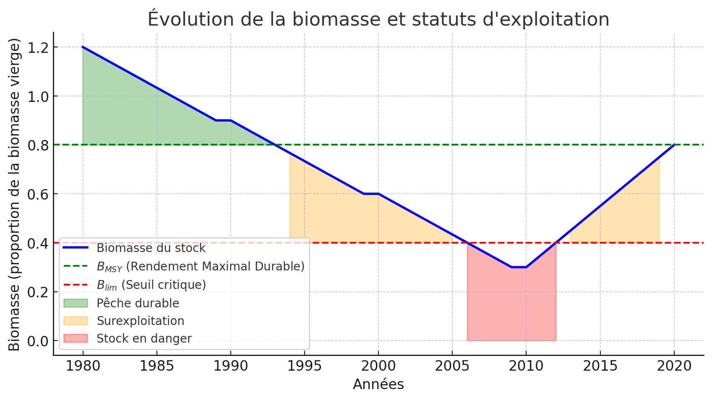
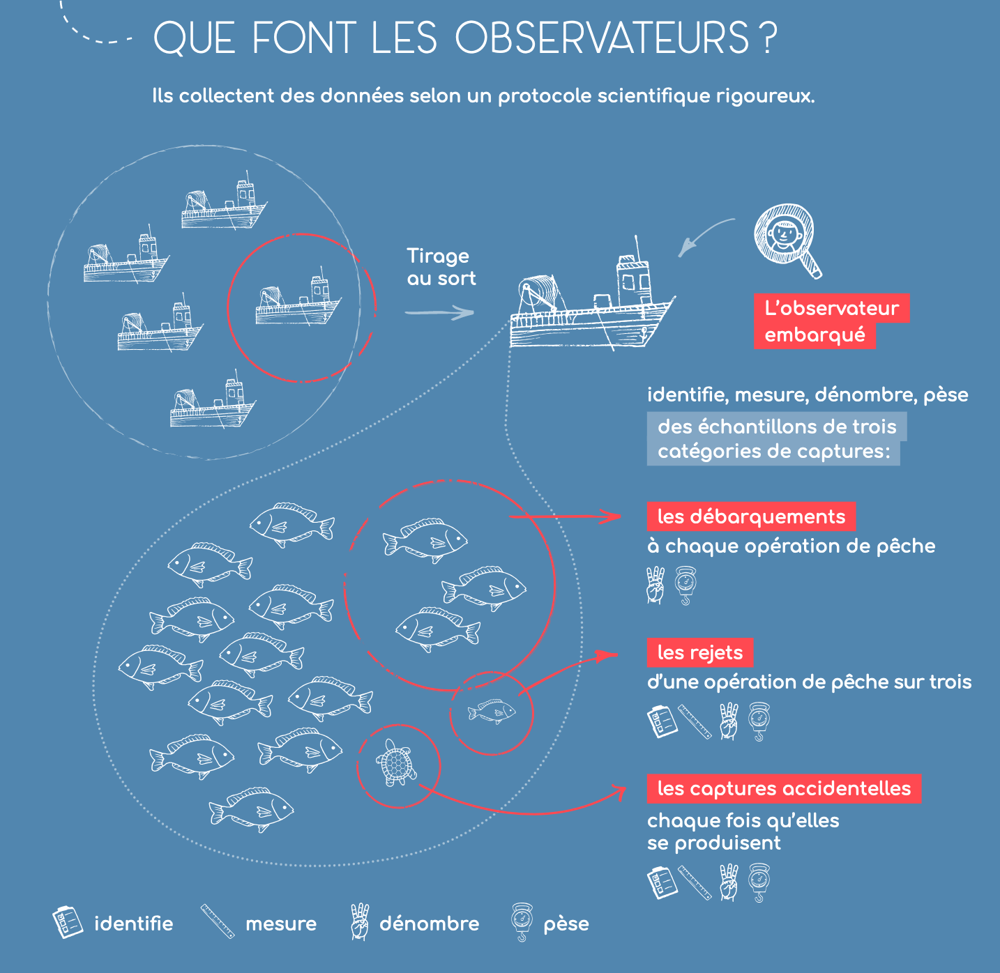
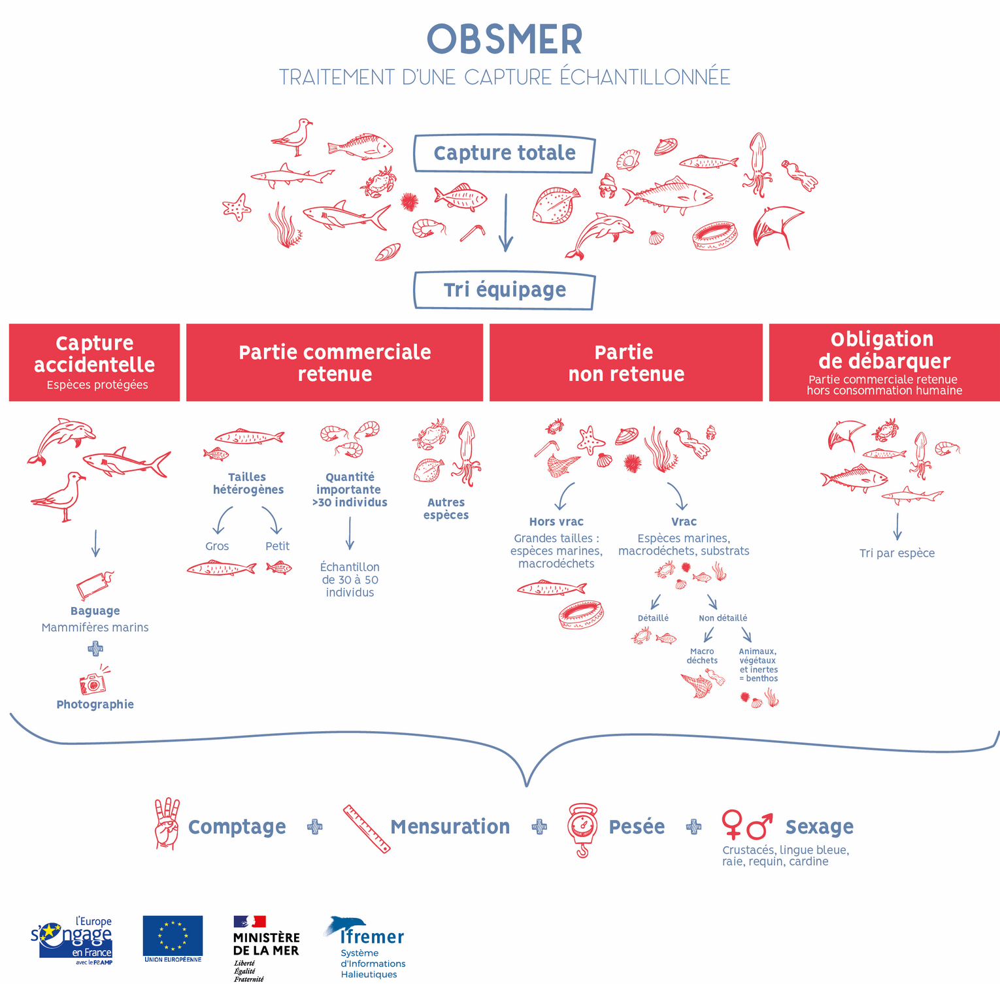

```{r setup, include=FALSE}
knitr::opts_chunk$set(echo = FALSE)
```

## Status d'exploitation des stocks

- **Rendement Maximal Durable (RMD) / Maximum Sustainable Yield (MSY) ** : quantité maximale prélevée par la pêche sur un stock de poissons sans compromettre son renouvellement naturel. Il correspond au niveau d’exploitation où le stock peut se reconstituer naturellement d’une année sur l’autre malgré les prélèvements effectués par la pêche.
- Soit $B$ est la biomasse du stock considérée, $B_{MSY}$ la biomasse du stock à son niveau d'exploitation durable maximum et $B_{lim}$ le seuil de biomasse en dessous duquel le stock risque de ne plus pouvoir se renouveler correctement. Lorsque la biomasse d’un stock descend sous ce niveau, le recrutement (l’arrivée de nouveaux individus dans la population) est fortement compromis, augmentant le risque d’effondrement du stock.
- Soit $F$ la mortalité par pêche, et $F_{MSY}$ la mortalité par pêche au niveau d'exploitation durable maximum.


## Status d'exploitation des stocks

Quelques définitions : $B$ biomasse / $F$ mortalité par pêche / $MSY$ : max sust yield 

| **Statut de gestion**       | **Condition**                                      | **Mesures recommandées** |
|-----------------------------|----------------------------------------------------|--------------------------|
| **Pêche durable**           | \( B > B_{MSY} \) et \( F \leq F_{MSY} \)         | Maintenir la gestion actuelle. |
| **Exploitation à risque**   | \( B_{lim} < B \leq B_{MSY} \) et \( F > F_{MSY} \) | Réduire la pression de pêche (quotas, effort, zones protégées). |
| **Stock menacé**            | \( B \leq B_{lim} \)                              | Mesures d’urgence (fermetures, restrictions strictes). |
| **Stock en rétablissement** | \( B \) en augmentation après gestion stricte     | Maintenir les efforts de conservation et ajuster progressivement la pêche. |

## Status d'exploitation des stocks

Quelques définitions : $B$ biomasse / $F$ mortalité par pêche / $MSY$ : max sust yield 

```{r, echo=FALSE, out.width="80%", fig.cap=""}

```

## Status d'exploitation des stocks

Diagramme de Kobé 

```{r, echo=FALSE, out.width="80%", fig.cap=""}

```

## Evolution de l'état d'exploitation des stocks

```{r, echo=FALSE, out.width="80%", fig.cap=""}

```


## Evolution de l'état d'exploitation des stocks

```{r, echo=FALSE, out.width="80%", fig.cap=""}

```

## Etat d'exploitation par espèces en 2023

```{r, echo=FALSE, out.width="80%", fig.cap=""}

```

Détails : <https://archimer.ifremer.fr/doc/00877/98852/>

## Statistiques des pêches ?

Comment renseigner l'activité des pêcheries ?

- les captures : débarquements, rejets, captures accidentelles...
- l'effort de pêche : temps passé en mer, nombre de marées, etc... voir <https://globalfishingwatch.org/map>
- les paramètres liées à la capturabilité des engins de pêche
- les paramètres biologiques liées aux captures : structure en taille, en âge, maturité sexuelle
- des informations relatives à la biomasse indépendante des activités de pêche
- tout autre paramètre utile à la compréhension de la dynamique de la population exploitée : migration (marquage), caractéristique génétique ou fonctionnelle (délimitation des stocks)
- on distingue les données dépendantes des pêcheries (captures, etc.) des données indépendantes (e.g. les campagnes scientifiques) 


## Statistiques des pêches en France

La collecte des données est coordonnée par l'Ifremer.

[source](<sih.ifremer.fr>)

```{r, echo=FALSE, out.width="100%", fig.cap=""}
knitr::include_graphics("../img/sacrois.png")
```

## Statistiques des pêches

Programme OBSMER [source](<sih.ifremer.fr>)

```{r, echo=FALSE, out.width="80%", fig.cap=""}

```

## Statistiques des pêches

Programme OBSMER [source](<sih.ifremer.fr>)

```{r, echo=FALSE, out.width="80%", fig.cap=""}

```

## Campagnes halieutiques

```{r, echo=FALSE, out.width="80%", fig.cap=""}
knitr::include_graphics("../img/Reseau-de-campagnes.png")
```

## Campagnes halieutiques

```{r, echo=FALSE, out.width="80%", fig.cap=""}
knitr::include_graphics("../img/ifr_camp2.png")
```

Les données récoltées sont disponibles en ligne : 

- <https://sih-indices-campagnes.ifremer.fr/>
- <https://datras.ices.dk/Data_products/Download/Download_Data_public.aspx>


## Bibliographie
