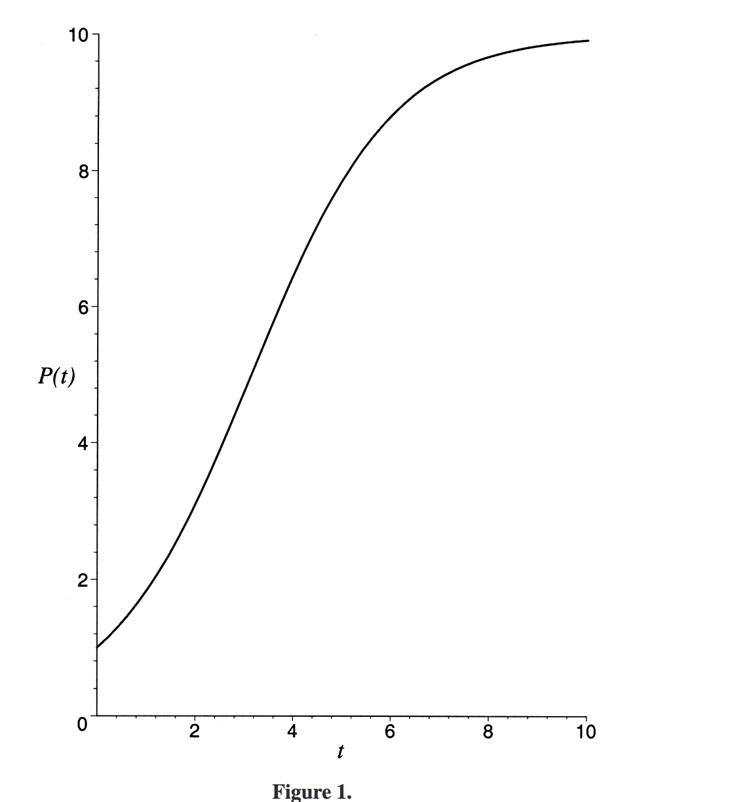
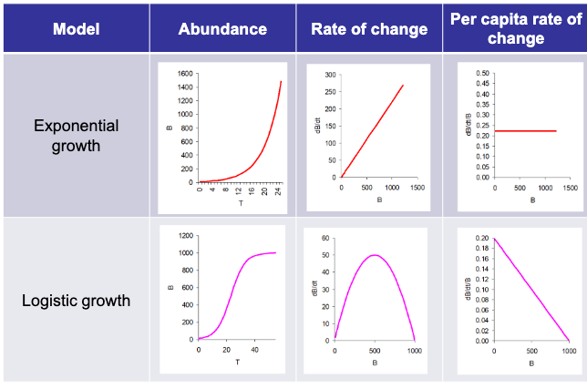
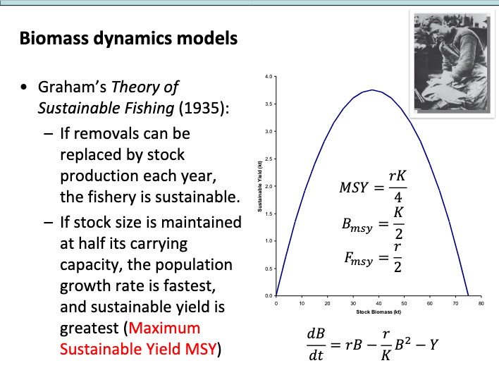

```{r setup, include=FALSE}
knitr::opts_chunk$set(echo = FALSE)
```


## Définitions (suite) : recrutement et cohorte

- recrutement : processus par lesquel les individus acquièrent une propriété qui les rend exploitable par la pêche (déplacement vers les zones de pêche, taille, comportement, etc.)
- âge et taille de recrutement : séparation entre une phase jeune (larves, post-larves et premiers stades juvéniles) à mortalité naturelle élevée, plasticité phénotypique, sensibilité à l'environnement vs phase plus âgée (juvéniles et adultes) moins sensible à la variabilité environnementale
- par extension : ensemble des individus recrutés à une date donnée

- cohorte : ensemble des individus d'un stock donné, né à une période donnée. En général une cohorte par an (si une seule saison de reproduction). Définie par l'année de naissance ou année de recrutement

Source : @gascuel2008


## Définitions : phase exploitable et phase exploitée

- accessibilité des cohortes à l'exploitation 
- résultante d'une mesure de gestion (maillage, période autorisée, etc.)

```{r, echo=FALSE, out.width="70%", fig.cap=""}
knitr::include_graphics("../img/cohorte_exploit.png")
```

Source : @gascuel2008


## Abondance, production et productivité biologique d'un stock

- abondance : mesure de la quantité d'individus présents dans le stock, en effectif (nombre d'individus, N) ou en biomasses (en tonnes, B)
- production biologique d'un stock (P) : quantité nette d'individus (en nombre ou en biomasse) produite pendant un intervalle de temps.

<div class='left' style='float:left;width:50%'>
En effectif : $$ P=\frac{dN}{dt}$$
</div>

<div class='right' style='float:right;width:50%'>
En biomasse : $$ P=\frac{dB}{dt}$$
</div>

- la production biologique (P) est la résultate de trois phénomènes : 
  - la reproduction : facteur d'accroissement de l'abondance
  - la mortalité : facteur de décroissance
  - la croissance pondérale : facteur de croissance (dans le raisonnement en biomasse)

- la productivité biologique est le ratio de la production biologique sur l'abondance (donc la production par individu ou unité de biomasse) :

<div class='left' style='float:left;width:50%'>
En effectif : $P=\frac{1}{N}\frac{dN}{dt}$
</div>

<div class='right' style='float:right;width:50%'>
En biomasse : $P=\frac{1}{B}\frac{dB}{dt}$
</div>


## Modélisation : généralités


- tout modèle est une abstraction ou une simulation de ce qui est connu sur le processus ou le phénomène simulé
- un modèle n'est pas une copie conforme de ces connaissances : la modélisation est une affaire de choix sur les processus les plus structurants pour le processus
- un modèle mathématique est un type de modèle (modèle physique, verbal, graphique, etc.)
- déterministe ou stochastique
- continu ou discret
- réaliste ou général
- paramètres
- variables

[ressources](<https://haddonm.github.io/URMQMF/on-modelling.html>)

## Modèlisation en halieutique

Différentes classes de modèle existent. Nous utiliserons ici un modèle de la dynamique de la biomasse totale d'un stock.

Développement du Modèle par Schaefer (1954-1957) :

- Milner B. Schaefer, biologiste/halieute américain, propose un modèle basé sur l'idée d'une production excédentaire d’une population exploitée.
- Il adapte l’équation logistique de croissance de population développée par Verhulst (1838) pour représenter la biomasse de poissons en fonction de l'effort de pêche.
    
```{r, echo=FALSE, out.width="40%", fig.cap=""}

```

- En 1954, il publie un premier article démontrant comment l'effort de pêche influence la capture et la biomasse d'une population : "Schaefer, M.B. (1954) Some aspects of the dynamics of populations, important for the management of the commercial marine fisheries. Inter-American Tropical Tuna Commission, 1, 7-56."
- En 1957, il affine son modèle en reliant la capture au rendement économique, ce qui aboutit au concept de rendement maximal durable (RMD ou MSY, Maximum Sustainable Yield).

## Modèle par Schaefer : adoption et application du modèle (1960-1980), limites et évolutions

- Dans les années 1960 et 1970, le modèle de Schaefer devient un outil clé pour la gestion des pêcheries à l'échelle mondiale.
- Les organisations internationales (e.g. FAO) l’adoptent pour recommander des niveaux optimaux d’effort de pêche.
- Cependant, le modèle repose sur plusieurs hypothèses simplificatrices qui ne prennent pas en compte la variabilité environnementale, les interactions trophiques ou les changements comportementaux des populations exploitées.

Limites et Évolutions (Années 1980-Aujourd’hui)

- 1980-1990 :  des critiques émergent sur le concept du RMD, car il ne prend pas en compte l’incertitude et les fluctuations des écosystèmes marins.
- nouveaux modèles bio-économiques : approche de Fox (1970) (modèle exponentiel) ou de Pella et Tomlinson (1969) (modèle généralisé de production), sont développés pour améliorer la gestion des stocks.
        
Aujourd’hui, des approches plus complexes sont utilisées, comme les modèles multi-espèces et les approches écosystémiques, mais le modèle de Schaefer reste un élément fondamental de la modélisation en halieutique.

Le modèle de Schaefer a marqué un tournant dans la gestion des pêcheries en introduisant une approche quantifiée et prédictive de l’exploitation des stocks halieutiques. Bien qu’il soit aujourd’hui considéré comme simpliste, il a posé les bases des modèles de gestion moderne et continue d’être utilisé comme référence pour l'évaluation des ressources marines.


## Modèle de Scheafer

Modèle de la dynamique de la biomasse d'un stock [@scheafer1957]
Modèle logistique discret,modèles globaux ou modèles de production ("surplus production models" en anglais).


$$
B_{t=0}=B_0
$$

$$
B_{t+1}=B_{t}+rB_t(1-\frac{B_t}{K})-C_t
$$
avec

- $t$ un indice associé au temps (année)
- $B_t$ la biomasse à l'instant $t$
- $r$ le taux de croissance
- $K$ la biomasse maximale que le système peut atteindre (carrying capacity)
- $C_t$ les captures à l'instant $t$

Exemple : si $B_t$=10t, $r$=0.2, $K$=100t et $C_t$=1, $B_t+1$=10.8 
$B_{t+1}$=10+0.2*10*(1-10/100)-1=10.8

Code !

## Dynamique générale

```{r, echo=FALSE, out.width="80%", fig.cap=""}

```

## Points de référence

```{r, echo=FALSE, out.width="80%", fig.cap=""}

```

## Tester la dynamique du modèle


## Bibliographie
